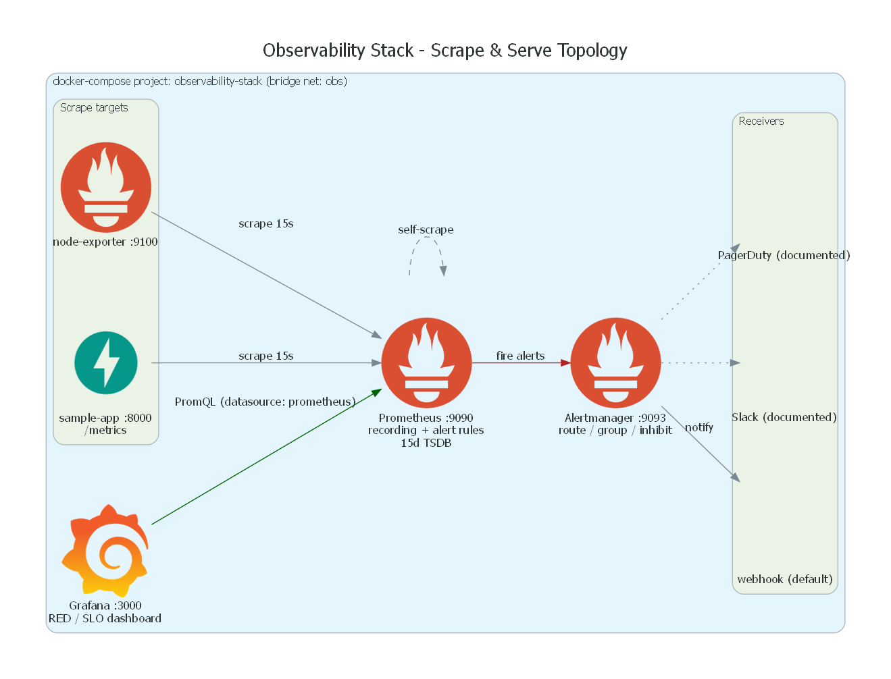
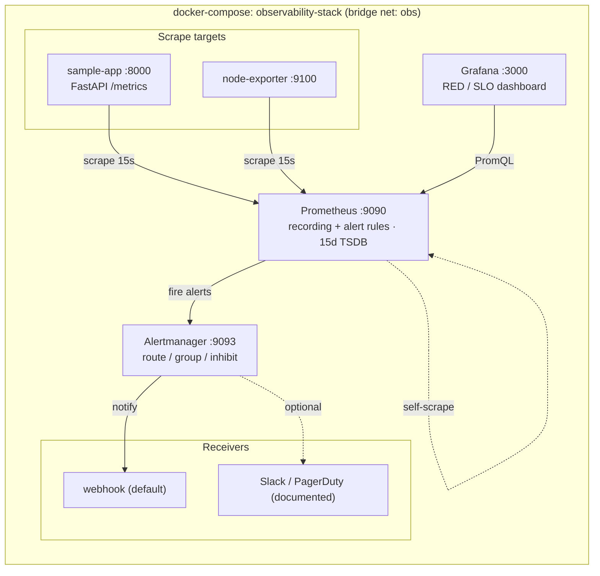
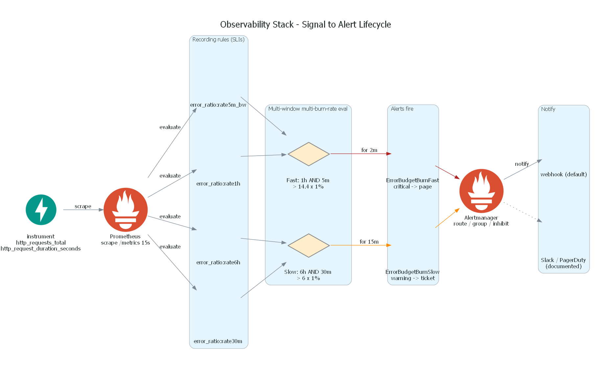
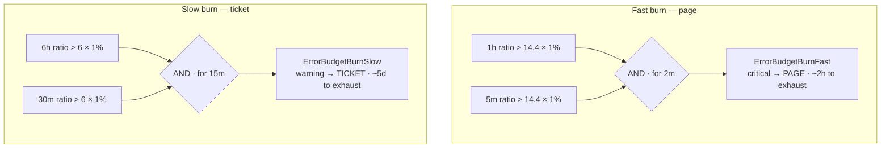
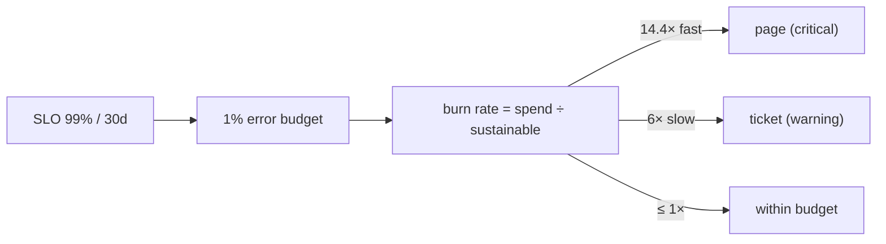

# Observability Stack — Prometheus + Grafana + Alertmanager

[](https://github.com/abdusirshad/observability-stack/actions/workflows/ci.yml)
[](https://prometheus.io)
[](https://grafana.com)
[](LICENSE)

A small but **production-shaped, fully runnable** observability stack you can bring
up locally with one command. It wires Prometheus, Grafana, Alertmanager and
node-exporter around a tiny instrumented FastAPI service, and ships real
**SLO/SLI recording rules**, **multi-window multi-burn-rate alerts** (Google SRE
model) and an auto-provisioned **RED/USE Grafana dashboard**.

> Author: **Md Irshad — Senior Cloud & AI Platform Engineer**

---

## Architecture

Prometheus scrapes the sample app, node-exporter and itself every 15 s,
evaluates recording + alerting rules, pushes firing alerts to Alertmanager, and
serves Grafana's PromQL queries — all in one Docker Compose project on a single
bridge network. No external services or secrets are required to run it.



<details>
<summary>Same diagram as Mermaid (renders inline on GitHub)</summary>


</details>

### Components & ports

| Service | Port | Role |
|---|---|---|
| Grafana | `:3000` | Auto-provisioned datasource + RED/SLO dashboard (admin / admin) |
| Prometheus | `:9090` | Scrape, rule evaluation, 15d TSDB, self-scrape |
| Alertmanager | `:9093` | Route / group / inhibit, notify receivers |
| sample-app | `:8000` | Instrumented FastAPI service, raw metrics at `/metrics` |
| node-exporter | `:9100` | Host CPU / memory / disk / net (USE) |

A deeper walkthrough — every diagram plus a per-rule / per-alert reference —
lives in [`docs/architecture.md`](docs/architecture.md).

---

## Repository layout

```
04-observability-stack/
├── docker-compose.yml              # the whole stack
├── Makefile                        # up / down / load / validate
├── app/                            # instrumented sample service
│   ├── main.py                     # FastAPI + prometheus_client (counter/histogram/gauge)
│   ├── requirements.txt
│   └── Dockerfile                  # slim, non-root
├── prometheus/
│   ├── prometheus.yml              # scrape configs + alertmanager + rule_files
│   └── rules/
│       ├── recording-rules.yml     # SLI recording rules (rate/error/latency/burn windows)
│       └── alerts.yml              # burn-rate + latency + infra alerts
├── alertmanager/
│   └── alertmanager.yml            # route + webhook receivers (Slack/PagerDuty documented)
├── grafana/
│   ├── provisioning/
│   │   ├── datasources/datasource.yml
│   │   └── dashboards/dashboards.yml
│   └── dashboards/
│       └── sample-app-red-slo.json # RED + SLO + USE panels, loads automatically
├── docs/
│   ├── runbooks.md                 # runbooks linked from alert annotations
│   ├── architecture.md             # deep dive: Mermaid + per-rule/alert reference
│   └── diagrams/                   # diagrams-as-code (mingrammer) + rendered PNGs
│       ├── architecture.py         # -> architecture.png
│       ├── alerting_flow.py        # -> alerting_flow.png
│       └── requirements.txt
├── .github/workflows/ci.yml        # yamllint + promtool + py-compile + compose config
├── .env.example                    # Grafana creds + optional receiver secrets
├── .gitignore
└── LICENSE                         # MIT, Md Irshad
```

---

## Quickstart

Requires Docker (with the Compose v2 plugin). `make` is optional — the raw
`docker compose` commands are shown alongside.

```bash
# 1. Build images and start everything (detached)
make up
#   equivalent: docker compose up -d --build

# 2. Generate some traffic so the dashboards/alerts have data
make load
#   equivalent: hits /, /work and /error in a loop (the /error path fails ~30%)

# 3. Open the UIs
#   Grafana       http://localhost:3000   (admin / admin)
#   Prometheus    http://localhost:9090
#   Alertmanager  http://localhost:9093
#   Sample app    http://localhost:8000   (raw metrics at /metrics)

# 4. Tear down (also removes the named data volumes)
make down
```

In Grafana the dashboard **Observability → Sample App - RED / SLO** is already
provisioned; just select it. Drive `make load` a few times and watch the error
ratio climb toward the 1% SLO budget line and the burn-rate alert fire in
Prometheus → **Alerts** and Alertmanager.

> Change the Grafana password by copying `.env.example` to `.env` and setting
> `GRAFANA_ADMIN_PASSWORD` before `make up`.

---

## The sample service

A ~120-line FastAPI app (`app/main.py`) instrumented with `prometheus_client`,
exposing all three core metric types:

| Endpoint   | Behaviour                                   | Metrics produced |
|------------|---------------------------------------------|------------------|
| `GET /`    | always 200, cheap                           | counter, histogram, gauge |
| `GET /work`| variable latency (sleeps), 200              | drives latency histogram |
| `GET /error`| returns 500 **~30%** of the time           | drives error-rate SLO |
| `GET /healthz` | liveness probe (excluded from metrics)  | — |
| `GET /metrics` | Prometheus exposition                   | — |

Metrics:

- `http_requests_total{method,path,status}` — **Counter** (RED: Rate + Errors)
- `http_request_duration_seconds{method,path}` — **Histogram** (RED: Duration)
- `app_inprogress_requests` — **Gauge** (saturation / in-flight requests)

---

## SLOs, SLIs and alerts

**SLO for `sample-app`:** 99% of requests succeed over 30 days → **1% error
budget**; p99 latency target **< 500 ms**.

### Recording rules (`prometheus/rules/recording-rules.yml`)

Pre-computed SLIs consumed by both the dashboard and the alerts:

| Recorded series | Meaning |
|---|---|
| `service:http_requests:rate5m` | request rate (5m) |
| `service:http_requests_error_ratio:rate5m` | error ratio (5m) — core SLI |
| `service:http_requests_success_ratio:rate5m` | availability (5m) |
| `service:http_request_duration_seconds:p99_5m` / `:p50_5m` | latency quantiles |
| `service:http_requests_error_ratio:{rate5m_bw,rate30m,rate1h,rate6h}` | burn-rate windows |

### Alerts (`prometheus/rules/alerts.yml`)

| Alert | Condition | Severity | Burns budget in |
|---|---|---|---|
| `ErrorBudgetBurnFast` | 1h **and** 5m error ratio > 14.4 × 1% | critical (page) | ~2 hours |
| `ErrorBudgetBurnSlow` | 6h **and** 30m error ratio > 6 × 1% | warning (ticket) | ~5 days |
| `LatencySLOBreachP99` | p99 (5m) > 500 ms | warning | — |
| `TargetDown` | `up == 0` for 1m | critical | — |
| `HighNodeCpuUsage` | node CPU > 90% for 10m | warning | — |
| `LowDiskSpace` | filesystem free < 10% for 10m | warning | — |

The two burn-rate alerts implement the **multi-window, multi-burn-rate** pattern
from the Google SRE workbook: a short window confirms the issue is current while
a long window confirms it is sustained, which suppresses flapping.



### Multi-window multi-burn-rate, at a glance

Each burn alert requires **both** windows to breach a budget-consumption
multiplier — the long window proves the burn is sustained, the short window
proves it is still happening (and makes the alert reset fast once it stops).



**SLO / error-budget concept:** at a 1× burn rate the 1% budget lasts exactly
30 days (99% success). 14.4× burns it in ~2 h (page); 6× in ~5 d (ticket).



Each alert carries a `runbook_url` pointing at [`docs/runbooks.md`](docs/runbooks.md).

---

## Alerting / Alertmanager

`alertmanager/alertmanager.yml` defines a route tree and **webhook receivers** so
the stack is self-contained — nothing leaves the host and no secrets are needed.
`critical` alerts take a dedicated branch, and an `inhibit_rule` mutes `warning`
alerts for a service while a `critical` one is already firing.

To wire real paging, uncomment the `slack_configs` / `pagerduty_configs` blocks
in that file and supply `SLACK_WEBHOOK_URL` / `PAGERDUTY_ROUTING_KEY` via your
secret manager (see `.env.example`). **Do not commit real keys.**

---

## Grafana dashboard

`grafana/dashboards/sample-app-red-slo.json` is auto-provisioned via
`grafana/provisioning/`. It combines:

- **RED** — request rate by path, error ratio vs the 1% SLO budget line, and
  p50/p99 latency vs the 500 ms SLO line.
- **USE** — in-flight requests gauge and node CPU saturation.
- **SLO stat row** — availability, request rate, error ratio and p99 at a glance,
  thresholded green/orange/red.

All panels query the recording rules above, so the dashboard and the alerts stay
consistent.

---

## How to run / verify

The following were used to validate this repo locally (see results in the repo
description / PR). They are also enforced in CI.

```bash
# Compose schema is valid
docker compose config -q

# Prometheus config + rules parse and type-check (runs promtool in a container)
make validate
#   docker run --rm -v "$PWD/prometheus:/etc/prometheus:ro" \
#     --entrypoint promtool prom/prometheus:v3.1.0 check config /etc/prometheus/prometheus.yml
#   ... check rules /etc/prometheus/rules/*.yml

# Sample app compiles
python -m py_compile app/main.py
```

CI (`.github/workflows/ci.yml`) runs four jobs on every push/PR, all on free
GitHub-hosted runners so the pipeline is green on a public fork:

1. **yamllint** — lints compose, Prometheus, Alertmanager and Grafana YAML.
2. **promtool** — `check config` + `check rules` in the official Prometheus image.
3. **py-compile** — byte-compiles the app and dry-run-installs requirements.
4. **compose config** — validates the Compose file.

---

## Pinned versions

| Component | Version |
|---|---|
| Prometheus | `v3.1.0` |
| Grafana | `11.4.0` |
| Alertmanager | `v0.28.0` |
| node-exporter | `v1.8.2` |
| Python base | `3.12-slim` |
| FastAPI / uvicorn / prometheus_client | `0.115.6` / `0.34.0` / `0.21.1` |

---

## What this demonstrates

- **SRE fundamentals in practice** — RED metrics, SLIs/SLOs, error budgets and
  the Google multi-window multi-burn-rate alerting model, wired end to end.
- **Prometheus rule design** — recording rules that pre-compute SLIs so the
  dashboard and alerts share one cheap, consistent source of truth.
- **Alert routing** — Alertmanager route tree, grouping, inhibition, and a clean
  path to real Slack / PagerDuty paging without committing secrets.
- **Observability as code** — auto-provisioned Grafana datasource + dashboard,
  a one-command runnable stack, diagrams-as-code, and a green CI that lints YAML,
  type-checks Prometheus config + rules, and validates the Compose file.

## Diagrams

The architecture and alerting-flow PNGs above are generated from
diagrams-as-code in [`docs/diagrams/`](docs/diagrams/) (mingrammer `diagrams` +
Graphviz):

```bash
make diagrams
#   pip install -r docs/diagrams/requirements.txt
#   cd docs/diagrams && python architecture.py && python alerting_flow.py
```

Mermaid mirrors of every diagram (plus the full per-rule / per-alert reference)
live in [`docs/architecture.md`](docs/architecture.md).

---

## License

[MIT](LICENSE) © Md Irshad
