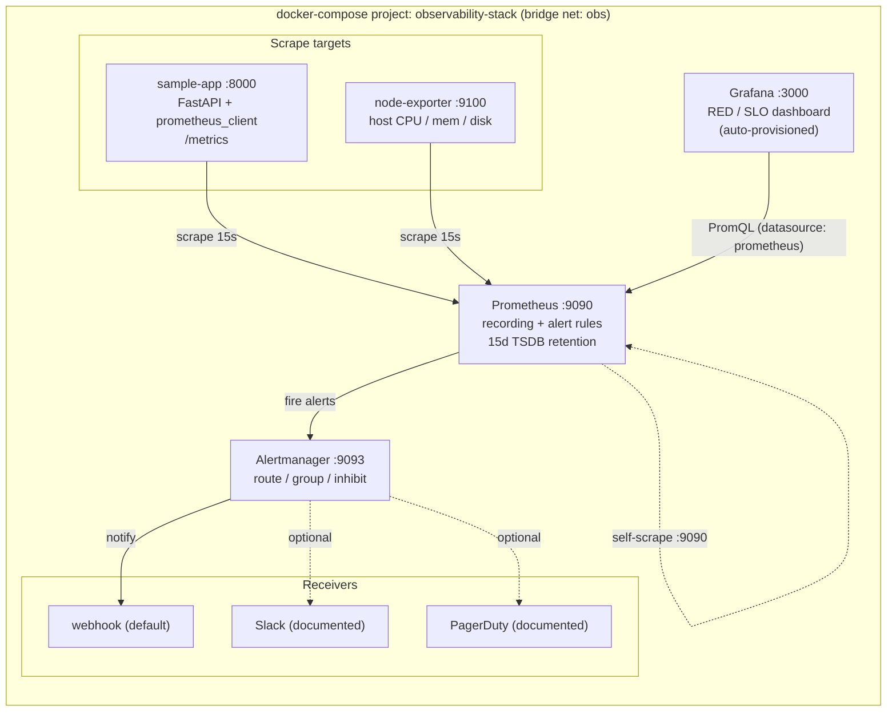
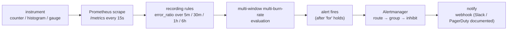
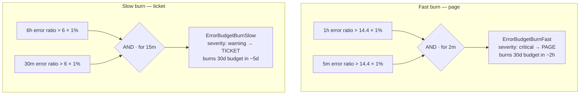
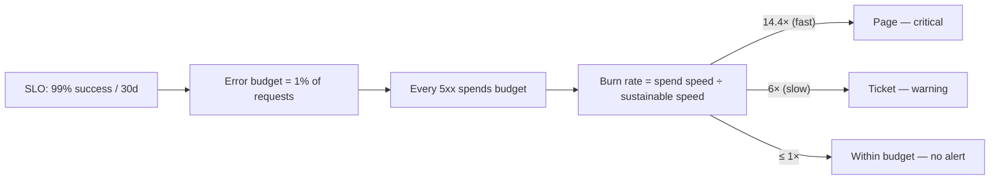
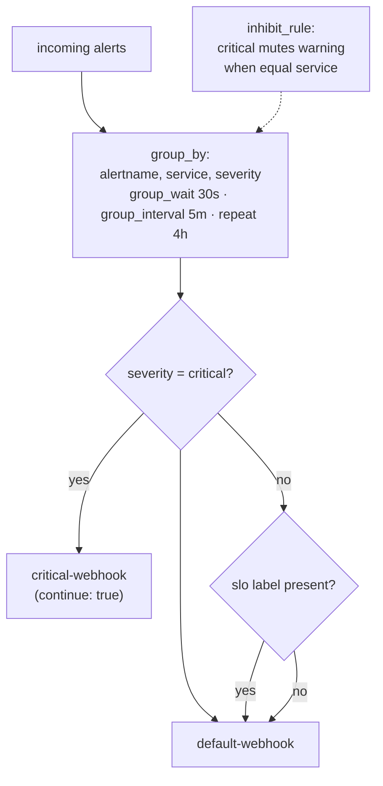

# Architecture deep dive

Design notes for the observability stack: how the services connect, how a signal
becomes an alert, the multi-window multi-burn-rate model, and a full per-rule /
per-alert reference. Everything here maps directly to the files in this repo.

> Author: **Md Irshad — Senior Cloud & AI Platform Engineer**

Rendered PNG versions of the first two diagrams live in
[`diagrams/`](diagrams/) and are generated from the diagrams-as-code sources
([`architecture.py`](diagrams/architecture.py),
[`alerting_flow.py`](diagrams/alerting_flow.py)) via `make diagrams`.

---

## 1. Scrape & serve topology

Prometheus pulls `/metrics` from three targets every 15 s, evaluates rules,
pushes firing alerts to Alertmanager, and serves Grafana's PromQL queries — all
inside one docker-compose project on the `obs` bridge network.

| Service | Image | Port | Role |
|---|---|---|---|
| `sample-app` | `observability-stack/sample-app` (built from `app/`) | 8000 | Instrumented FastAPI service exposing `/metrics` |
| `node-exporter` | `prom/node-exporter:v1.8.2` | 9100 | Host CPU / memory / disk / net metrics (USE) |
| `prometheus` | `prom/prometheus:v3.1.0` | 9090 | Scrape, rule evaluation, 15d TSDB, self-scrape |
| `alertmanager` | `prom/alertmanager:v0.28.0` | 9093 | Route / group / inhibit, notify receivers |
| `grafana` | `grafana/grafana:11.4.0` | 3000 | Auto-provisioned datasource + RED/SLO dashboard |

---

## 2. Signal → alert data flow

The `for:` clause on each alert means a condition must hold continuously before
it fires (2 m fast, 15 m slow, 5 m latency, 1 m target-down) — this de-bounces
transient spikes.

---

## 3. Multi-window, multi-burn-rate explainer

Two burn-rate alerts share one SLO (99% availability → 1% error budget). Each
requires **both** a long window (is the burn sustained?) **and** a short window
(is it still happening right now?) to exceed a budget-consumption multiplier.
The short window is what makes the alert *reset quickly* once the incident ends.

| Alert | Long window | Short window | Multiplier | Budget exhausted in | Action |
|---|---|---|---|---|---|
| `ErrorBudgetBurnFast` | 1h | 5m (`rate5m_bw`) | 14.4× | ~2 hours | Page (critical) |
| `ErrorBudgetBurnSlow` | 6h | 30m | 6× | ~5 days | Ticket (warning) |

Why 14.4? Burning at 14.4× the sustainable rate for 1h consumes
`14.4 × (1h / 30d) ≈ 2%` of the month's budget in an hour — i.e. the full 1%
budget in roughly 2 hours, which is page-worthy. 6× over a long window is a
slow leak worth a ticket, not a 3 a.m. page.

---

## 4. SLO / error-budget concept

A burn rate of 1× spends the budget exactly over the 30-day window (i.e. lands
at 99% success). Anything above 1× trends toward budget exhaustion; the two
thresholds pick the response urgency.

---

## 5. Recording-rule reference

Source: [`prometheus/rules/recording-rules.yml`](../prometheus/rules/recording-rules.yml).
Naming follows the Prometheus `level:metric:operation` convention.

| Recorded series | Group (interval) | PromQL intent |
|---|---|---|
| `service:http_requests:rate5m` | `sample-app.sli.recording` (15s) | Total request rate over 5m, per `service` |
| `service:http_requests_errors:rate5m` | `sample-app.sli.recording` | Rate of `5xx` responses over 5m |
| `service:http_requests_error_ratio:rate5m` | `sample-app.sli.recording` | Errors ÷ total (core availability SLI), `clamp_min` guards 0/0 |
| `service:http_requests_success_ratio:rate5m` | `sample-app.sli.recording` | `1 − error_ratio` (availability) |
| `service:http_request_duration_seconds:p99_5m` | `sample-app.latency.recording` (15s) | `histogram_quantile(0.99, …)` on the latency histogram |
| `service:http_request_duration_seconds:p50_5m` | `sample-app.latency.recording` | p50 latency |
| `service:http_requests_error_ratio:rate5m_bw` | `sample-app.burnrate.recording` (30s) | Error ratio over 5m — fast-burn short window |
| `service:http_requests_error_ratio:rate30m` | `sample-app.burnrate.recording` | Error ratio over 30m — slow-burn short window |
| `service:http_requests_error_ratio:rate1h` | `sample-app.burnrate.recording` | Error ratio over 1h — fast-burn long window |
| `service:http_requests_error_ratio:rate6h` | `sample-app.burnrate.recording` | Error ratio over 6h — slow-burn long window |

Recording rules are evaluated once and reused by both the dashboard and the
alerts, so the two never disagree and each PromQL is cheap to serve.

---

## 6. Alert reference

Source: [`prometheus/rules/alerts.yml`](../prometheus/rules/alerts.yml). Every
alert carries a `runbook_url` pointing at [`runbooks.md`](runbooks.md).

| Alert | Group | Expression (intent) | `for` | Severity | Runbook |
|---|---|---|---|---|---|
| `ErrorBudgetBurnFast` | `sample-app.slo.availability` | `rate1h` **and** `rate5m_bw` > 14.4 × 0.01 | 2m | critical (page) | [Error budget burn](runbooks.md#error-budget-burn) |
| `ErrorBudgetBurnSlow` | `sample-app.slo.availability` | `rate6h` **and** `rate30m` > 6 × 0.01 | 15m | warning (ticket) | [Error budget burn](runbooks.md#error-budget-burn) |
| `LatencySLOBreachP99` | `sample-app.slo.latency` | `p99_5m` > 0.5 (500 ms) | 5m | warning | [Latency SLO breach](runbooks.md#latency-slo-breach) |
| `TargetDown` | `infrastructure.targets` | `up == 0` | 1m | critical | [Target down](runbooks.md#target-down) |
| `HighNodeCpuUsage` | `infrastructure.targets` | `100 × (1 − avg idle CPU rate 5m)` > 90 | 10m | warning | [High node CPU / low disk](runbooks.md#high-node-cpu--low-disk) |
| `LowDiskSpace` | `infrastructure.targets` | filesystem avail ÷ size × 100 < 10 | 10m | warning | [High node CPU / low disk](runbooks.md#high-node-cpu--low-disk) |

---

## 7. Alertmanager routing

Source: [`alertmanager/alertmanager.yml`](../alertmanager/alertmanager.yml).

- **Default receiver** — `default-webhook` (a local HTTP sink; nothing leaves
  the host, no secrets).
- **Critical branch** — matches `severity = "critical"`, sends to
  `critical-webhook`, `continue: true` so the alert also reaches the default
  branch.
- **Inhibition** — a firing `critical` alert mutes `warning` alerts for the same
  `service`, cutting duplicate noise during an incident.
- **Real paging** — uncomment the `slack_configs` / `pagerduty_configs` blocks
  and supply `SLACK_WEBHOOK_URL` / `PAGERDUTY_ROUTING_KEY` from a secret manager.
  **Never commit real keys.**

---

## 8. Grafana dashboard

Source: [`grafana/dashboards/sample-app-red-slo.json`](../grafana/dashboards/sample-app-red-slo.json),
auto-provisioned via [`grafana/provisioning/`](../grafana/provisioning/). Every
panel queries the recording rules above so the dashboard and alerts stay
consistent.

| Panel | Type | PromQL / intent |
|---|---|---|
| Availability (success ratio, 5m) | stat | `service:http_requests_success_ratio:rate5m` — green ≥ 99.9%, orange ≥ 99% |
| Request rate (5m) | stat | `service:http_requests:rate5m` (req/s) |
| Error ratio (5m) | stat | `service:http_requests_error_ratio:rate5m` — orange ≥ 1%, red ≥ 5% |
| p99 latency (5m) | stat | `service:http_request_duration_seconds:p99_5m` — orange ≥ 500 ms |
| Request rate by path (RED: Rate) | timeseries | `sum by (path) (rate(http_requests_total[5m]))` |
| Error ratio vs SLO budget (RED: Errors) | timeseries | error ratio 5m vs `vector(0.01)` budget line |
| Latency p50 / p99 vs SLO (RED: Duration) | timeseries | p50 & p99 vs `vector(0.5)` 500 ms SLO line |
| Saturation: in-flight & node CPU (USE) | timeseries | `app_inprogress_requests` + node CPU busy % |
